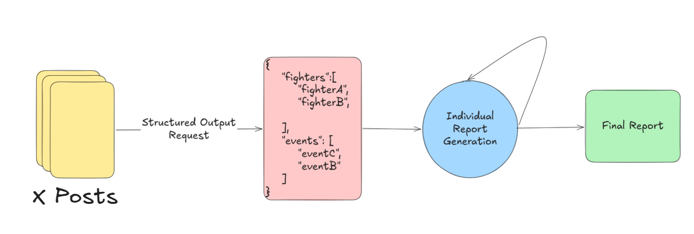

# MMA Report Agent

This is an agent that generates daily reports out of the latest news of the MMA world.
The vision is to create a subscription service based on this agent on the long run after the agent is supposedly characterised reliable.

The Agent follows the below structure in generating a Report



## The Problem:
In an mma fight every information counts , such as Late Notice Fights or minor injuries. In order to be able to properly calculate the outcome of a fight , one must be aware of as much information possible regarding the fighters. But in order to get that information , one must also spend a lot of time surfing the web for anything of value.

## The Solution:
Instead of scrolling through social media and looking for anything of value  , I created this agent that daily gathers information from selected profiles and generates a simple and cohesive report that I can read at the start of my day.

## The Implementation:

The Agent comprises of the parts below:
1. **The information gathering**
2. **The fighter/events pinpointing** 
3. **The individual generation of reports per fighter/event**
4. **Adding everything into the final Report**


### 1. Information Gathering

For a daily report we need fast news and a very good solution for fast and trending news always is X.
Upon selecting a number of profiles that specialize on fast news on the MMA sector, I get the text out of these profiles and store it locally.

### 2. Fighter/Event Pinpointing

In order to not miss out on any of the important figures , the agent is tasked to send a request to an LLM of Choice ( either Local or via API) and generate a Structured output of the below format:
```json
{
    "fighters":[
        "fighterA",
        "fighterB",

    ],
    "events": [
        "eventC",
        "eventB"
    ]
}
```

This way the LLM is tasked to get all the fighters/events , thus tasked to a limited task and minimizing the risk of leaving any fighter/event out of the picture.

### 3. Individual Report Generation

After the extracting all the Fighters and Events follows the Individual Report Generation , where the agent iterates throught each extracted entity and genererate a number of small reports from a structured output request

### 4. Final Report
All the extracted information from the steps **2 and 3** are used to build a Class that later allows us to generate a final report in that has a standard format that can be replicated every time.

---

### Notes
* **Why does the agent follow this format?**

This format is secures the below objectives:
    - The LLM has greater chances to get all the Fighters/Events out of the texts provided in the input by Extracting the entities first and generating the reports later.
    - By making seperate requests for each entity's reports , we make sure that the LLM's task is smaller and simpler and minimizes the chanses that valuable information is being left out. ( This is more expensive as we make more requests , but makes sure that the LLM can focus better on the task)
    - By making structured output reports, we force the LLM to generate text in a similar manner and it also aids in having a structure in the Final Report.

